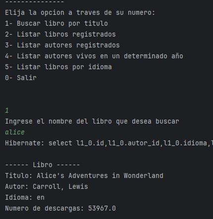
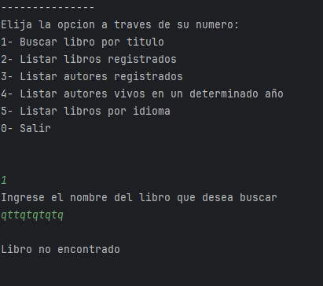
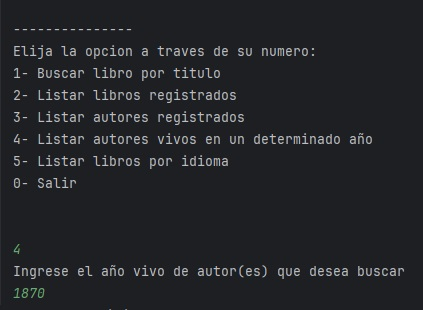
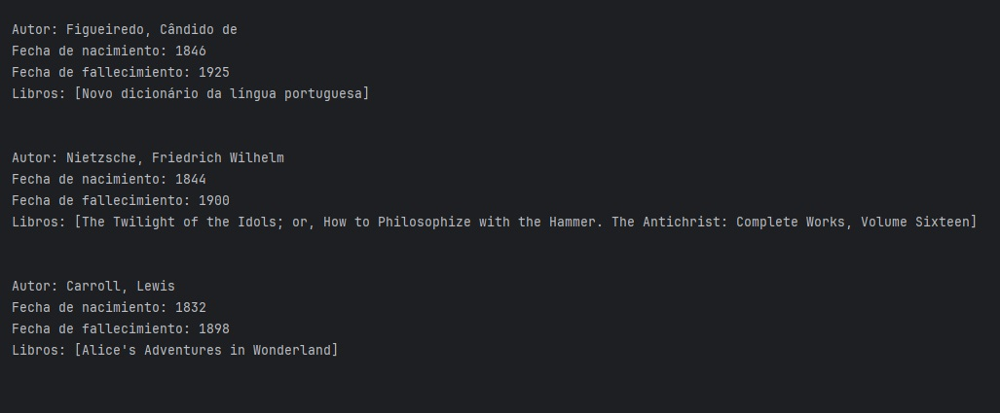
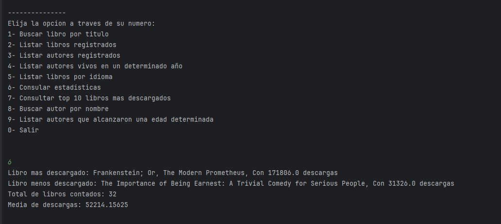

# Literalura

Este es un proyecto interactivo en el que podrás realizar:
1) Busqueda y registro de un libro mediante una API
2) Listar los libros ya registrados a la base de datos
3) Listar los autores registrados a la base de datos
4) Listar los autores vivos en una fecha ingresada
5) Listar los libros por idioma registrados en la base de datos 

## Instalación

Para instalar el proyecto se necesita clonar el repositorio

```bash
  git clone https://github.com/OscarCuso/literalura
  cd literalura
```

## Uso del proyecto

Para iniciar el proyecto es necesario abrirlo desde un IDE, una vez abierto el proyecto lo podemos iniciar

Una vez iniciando el proyecto aparecerá este menu


En la primera opcion podremos buscar un libro con su nombre y sera guardado a la base de datos


En dado caso que se quiera agregar uno ya existente, no dejara y saldra un mensaje que no se pudo registrar


Tambien en caso de que se ingrese un nombre incorrecto o un libro que no esté en la API saldra mensaje de que no se pudo encontrar


En la segunda opcion se mostrará los libros registrados en la base de datos 


En la tercera opcion se mostrará los autores registrados en la base de datos


En la cuarta opcion podremos ingresar un año y se mostrará los autores vivos en esa epoca



En la quinta opcion nos mostrará la lista de libros registrados en un idioma que seleccionemos


Y por último en la sexta opcion, nos saca de la aplicacion



## Autores

- [@OscarCuso](https://github.com/OscarCuso)